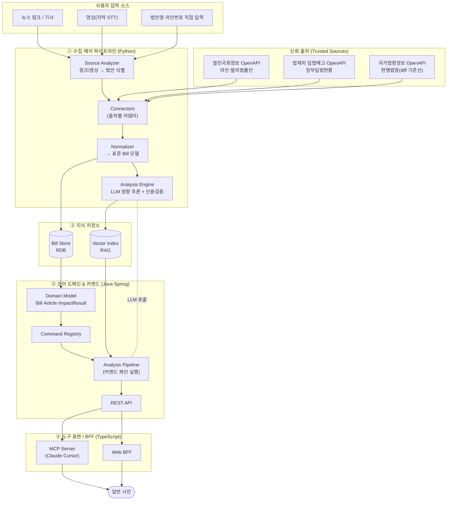

# 입법 영향 분석기 (LIA · Legislative Impact Analyzer) — 아키텍처 설계

> 입법 예정인 법안이 **나에게 어떤 변화를 주는지, 무엇을 해야 하는지**를
> 일반 시민의 언어로 알려주는 서비스. 확장 가능한 폴리글랏 구조.

문서 버전 0.1 · 2026-05-31 · 상태: **대체됨(superseded by v0.2)**

> 이 파일은 v0.1 시점의 **동결 스냅샷**이다. 수정하지 말 것.
> v0.2에서 무엇이/왜 바뀌었는지는 [`../ARCHITECTURE.md`](../ARCHITECTURE.md) 색인 참고.

---

## 1. 한 줄 정의와 설계 원칙

참고한 `korean-law-mcp`는 **이미 시행 중인 현행 법령**을 검색·검증·시각화한다. 우리 서비스의 차별점은 **아직 시행 전인(발의·심사·공포 단계의) 법안**을 다루고, 그것이 *특정 사용자에게 미칠 영향*과 *대처 행동*으로 번역한다는 점이다. 따라서 데이터 소스, 시간 축(미래 시행일), 출력 레이어(개인화·행동지침)가 근본적으로 다르다.

설계를 관통하는 네 가지 원칙을 먼저 못박는다.

첫째, **신뢰 가능한 출처에서만 원천 데이터를 가져온다.** 모든 분석 결과는 의안 원문·조문·시행일이라는 일차 출처로 역추적 가능해야 한다(참고 리포의 `verify_citations` 사상). 둘째, **수집과 해석을 분리한다.** "법안 데이터를 정규화해 저장"하는 파이프라인과, "use-case별로 후처리"하는 커맨드 계층은 서로의 내부를 몰라야 한다. 셋째, **확장은 새 커맨드를 추가하는 일이지 코어를 고치는 일이 아니다**(개방-폐쇄 원칙). 넷째, **입력 소스는 다양하다.** API뿐 아니라 사용자가 던지는 뉴스 링크·영상도 "법안 식별"이라는 동일한 정규 흐름으로 수렴시킨다.

---

## 2. 전체 구조 (3-런타임 폴리글랏)

언어를 임의로 섞지 않고, 각 언어가 가장 강한 책임에 배치했다.

- **Python — 수집·해석 파이프라인.** 공공 OpenAPI 커넥터, 크롤링/문서 추출, NLP·LLM 기반 영향 추론, RAG 인덱싱. 데이터/ML 생태계가 압도적으로 풍부.
- **Java Spring — 코어 도메인 & 커맨드 오케스트레이션.** 도메인 모델의 단일 진실 공급원, use-case별 커맨드 레지스트리/파이프라인, 트랜잭션·권한·REST API. 장기 유지보수와 팀 협업에 강함.
- **TypeScript — MCP 서버 & 도구 표면(BFF).** 참고 리포처럼 Claude·Cursor 등에서 바로 쓰는 MCP 도구, 그리고 웹 클라이언트용 BFF. MCP SDK 생태계가 가장 성숙.



데이터는 항상 한 방향으로 흐른다. **출처 → 정규화 → 저장 → 커맨드 후처리 → 도구 표면**. 사용자가 던진 링크·영상도 Source Analyzer가 "이 콘텐츠가 가리키는 법안이 무엇인가"를 식별한 뒤 동일한 커넥터 경로로 합류시킨다. 즉 입력 소스가 늘어나도 하류 구조는 건드리지 않는다.

---

## 3. 데이터 파이프라인 (Python)

### 3.1 신뢰 출처와 커넥터

| 출처 | 용도 | API |
|---|---|---|
| 열린국회정보 | 발의 법안 목록·진행단계·의안 원문 | `open.assembly.go.kr` Open API |
| 법제처 정부입법예고 | 정부 제출 법안·입법예고·시행 예정 | 공공데이터포털 정부입법예고/정부입법현황 |
| 국가법령정보 공동활용 | 현행 조문(개정 전후 diff 기준선) | `open.law.go.kr` Open API |

각 출처는 `SourceConnector` 추상 인터페이스를 구현한다. 인증키·페이징·필드명이 출처마다 다르지만, 커넥터 밖으로는 표준 `RawBill`만 내보낸다. 새 출처(지자체 조례, 국세청 해석례 등)는 커넥터 한 개를 더 추가하면 끝이다.

### 3.2 표준 도메인 모델

```
Bill         { id, billNo(의안번호), title, summary, proposers,
               proposeDate, committee, stage, effectiveDate(시행예정일),
               sourceType, sourceUrl, fullText, articles[], baselineLawId }
Article(조문) { no, title, text, changeType(신설/개정/삭제), diffVsCurrent }
Stage        발의 → 위원회심사 → 본회의 → 정부이송 → 공포 → 시행
```

진행단계(Stage)와 시행예정일을 1급 시민으로 두는 것이 현행법 서비스와의 핵심 차이다. "언제부터 바뀌나"가 일반 시민 입장에서 가장 중요한 정보이기 때문이다.

### 3.3 소스 입력 분석 흐름 (링크 / 뉴스 / 영상)

```
사용자 입력 → SourceAnalyzer
  ├─ URL        : fetch + 본문 추출(readability)
  ├─ 영상        : 자막 API 우선, 없으면 STT
  └─ 텍스트      : 그대로
        → LLM 엔티티 추출 (법안명, 의안번호, 소관위, 키워드)
        → 의안 DB 대조(퍼지 매칭) → 표준 Bill 해소(resolve)
        → 해소 실패 시: 후보 N개 제시 + "정확히 이 법안 맞나요?" 확인
```

여기서 LLM은 *분석가가 아니라 식별자(resolver)* 역할만 한다. 실제 법안 데이터는 반드시 신뢰 출처에서 다시 가져온다. 뉴스가 틀리거나 과장돼도 원문이 기준이 되도록 하기 위함이다.

### 3.4 해석 엔진과 인용 검증

정규화된 Bill을 RAG 인덱스에 적재하고, 영향 추론 시 LLM에 **조문 원문 + 현행법 diff**를 컨텍스트로 제공한다. 출력의 모든 주장에는 근거 조문 ID를 부착하고, 후처리 단계에서 그 조문이 실제 의안 원문에 존재하는지 교차검증한다(환각 차단).

---

## 4. use-case별 후처리 커맨드 구조 (확장성의 심장)

요청하신 "use-case별 post-processing command 구조"를 설계의 중심에 둔다. 수집된 Bill은 그 자체로는 원자재일 뿐이고, **가치는 특정 use-case로 후처리할 때 생긴다.** 이를 커맨드 패턴으로 모듈화한다.

### 4.1 인터페이스

```java
interface AnalysisCommand<P, R> {
    String name();                       // 도구/엔드포인트 식별자
    boolean supports(CommandContext ctx);// 실행 가능 여부(예: 페르소나 필요)
    Set<Requirement> requirements();     // 필요한 선행 데이터(현행법 diff 등)
    R execute(CommandContext ctx, P params);
}
```

`CommandContext`는 대상 Bill, 사용자 페르소나(직장인·자영업자·임차인·학부모 등), 해석 엔진 핸들, 인용 검증기를 담는다. 오케스트레이터(`AnalysisPipeline`)는 커맨드가 선언한 `requirements()`를 보고 선행 데이터(예: 현행법 조문, diff)를 자동으로 채워 넣은 뒤 실행한다.

### 4.2 MVP 커맨드 (일반 시민용)

| 커맨드 | 하는 일 | 비고 |
|---|---|---|
| `ImpactSummaryCommand` | 법안을 평이한 말로 요약 | "한 문단 + 핵심 3가지" |
| `PersonaImpactCommand` | 내 상황(페르소나)에 무엇이 바뀌나 | 개인화의 핵심 |
| `ActionPlanCommand` | 시행일 기준 해야 할 일 + 기한 | 참고 리포 `action_plan` 재해석 |
| `LawDiffCommand` | 현행법 대비 무엇이 달라지나 | 참고 리포 `time_travel` 재해석 |
| `StageTrackerCommand` | 발의→시행 진행단계·통과 가능성 | 미래 시점 추적 |
| `SourceResolveCommand` | 링크/영상 → 법안 식별 | 3.3 흐름의 진입점 |

### 4.3 확장 방식

새 use-case = 새 `AnalysisCommand` 구현체 한 개 + 레지스트리 등록(Spring이라면 `@Component`로 자동 발견). 코어·파이프라인·도구 표면은 손대지 않는다.

향후 확장 예시: 업종별 규제영향(`SectorRegulationCommand`), 예상 비용/세금 영향(`CostEstimateCommand`), 지자체 조례 연동(`OrdinanceLinkCommand`), 유사 과거법안 결과 비교(`PrecedentCommand`), 변화 알림(`NotificationCommand`). 커맨드는 체인으로 조합 가능하다(예: `SourceResolve → LawDiff → PersonaImpact → ActionPlan`).

---

## 5. 도구 표면 (TypeScript MCP / BFF)

참고 리포처럼 MCP 도구로 노출하면 Claude·Cursor 등에서 바로 쓰이고, 동시에 웹 클라이언트용 BFF가 된다. 각 MCP 도구는 본질적으로 코어의 커맨드 한 개(또는 체인)에 1:1로 매핑된다.

| MCP 도구 | 매핑 커맨드 |
|---|---|
| `search_upcoming_bills` | 의안 검색(파이프라인 조회) |
| `analyze_from_url` | `SourceResolve → ImpactSummary` |
| `get_impact_for_me` | `PersonaImpact` |
| `get_action_plan` | `ActionPlan` |
| `diff_vs_current_law` | `LawDiff` |

도구 표면이 커맨드와 1:1이므로, 새 커맨드를 추가하면 새 MCP 도구를 거의 자동으로 얻는다.

---

## 6. 확장성·운영 관점 요약

신규 **데이터 출처**는 커넥터 추가, 신규 **use-case**는 커맨드 추가, 신규 **클라이언트**는 BFF/MCP 도구 추가로 각각 독립적으로 늘어난다. 세 축이 서로 결합돼 있지 않다는 점이 이 설계의 요지다.

수집은 증분 동기화(스케줄러)로 돌리고, 해석 결과는 캐시한다(같은 법안·같은 페르소나면 재사용). 모든 출력은 일차 출처로 역추적되며 인용 검증을 통과해야 하므로, 법률 정보 서비스로서 갖춰야 할 신뢰성 요건을 구조적으로 만족한다.

법률·정책 정보는 변동되며, 본 서비스는 법률 자문이 아니라 참고용 정보 제공임을 사용자에게 명시해야 한다.

---

## 7. 다음 단계 제안

1. PoC 스캐폴드(`/pipeline`, `/core`, `/mcp`)에서 한 개의 수직 슬라이스를 끝까지 동작시키기: 열린국회정보에서 법안 1건 수집 → 정규화 → `ImpactSummaryCommand` → MCP 도구 응답.
2. 공공데이터포털·열린국회정보 API 키 발급 및 레이트리밋 정책 확정.
3. 페르소나 모델 1차 정의(일반 시민 5~6개 유형)와 `PersonaImpactCommand` 프롬프트 설계.
4. 인용 검증기(claim ↔ 조문 ID 매핑) 규칙 확정.
