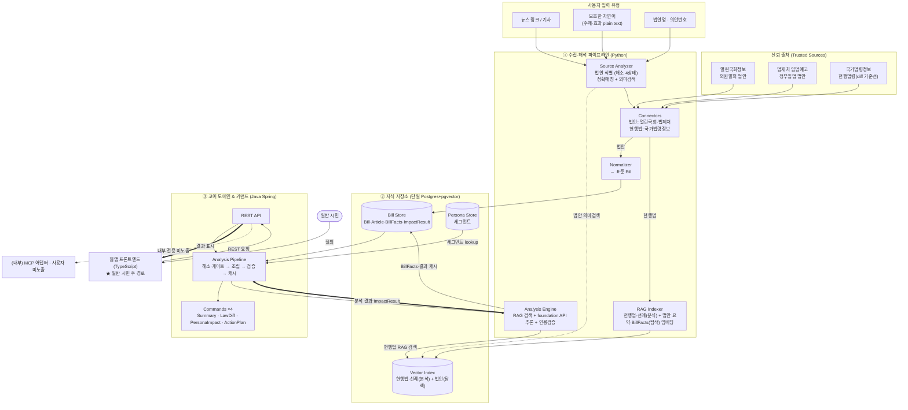

# 입법 영향 분석기 (LIA · Legislative Impact Analyzer) — 아키텍처 설계

> 입법 예정인 법안이 **나에게 어떤 변화를 주는지, 무엇을 해야 하는지**를
> 일반 시민의 언어로 알려주는 **웹앱** 서비스. 확장 가능한 폴리글랏 구조.

문서 버전 0.5 · 2026-06-28 · 상태: **현행(latest)**

> 변경 이력과 버전별 설계 이유는 [`../ARCHITECTURE.md`](../ARCHITECTURE.md) 색인 참고.
> 이 파일은 v0.5 시점의 **동결 스냅샷**이다. 수정하지 말 것 — 새 버전은 새 파일로.
> 컴포넌트 단위 상세는 [`../components/component-specs.md`](../components/component-specs.md), 결정 이력은 [`../adr/decision-log.md`](../adr/decision-log.md).

---

## 1. 한 줄 정의와 설계 원칙

참고한 `korean-law-mcp`는 **이미 시행 중인 현행 법령**을 검색·검증·시각화한다. 우리 서비스의 차별점은 **아직 시행 전인(발의·심사·공포 단계의) 법안**을 다루고, 그것이 *특정 사용자에게 미칠 영향*과 *대처 행동*으로 번역한다는 점이다. 따라서 데이터 소스, 시간 축(미래 시행일), 출력 레이어(개인화·행동지침)가 근본적으로 다르다.

설계를 관통하는 네 가지 원칙.

첫째, **신뢰 가능한 출처에서만 원천 데이터를 가져온다.** 모든 주장(claim)에 근거 조문 `source_id`를 부착하고, 통과하지 못하면 노출하지 않는다(인용 게이트). 둘째, **수집과 해석을 분리한다.** 정규화·적재 파이프라인과 use-case별 커맨드는 서로의 내부를 몰라야 한다. 셋째, **확장은 새 커맨드·커넥터를 추가하는 일이지 코어를 고치는 일이 아니다**(개방-폐쇄). 넷째, **입력 소스는 다양하다.** API뿐 아니라 사용자가 던지는 뉴스 링크·기사·**모호한 자연어(plain text)** 도 "법안 식별"이라는 동일한 정규 흐름으로 수렴시킨다.

---

## 2. 전체 구조 (3-런타임 폴리글랏)

- **Python — 수집·해석 파이프라인.** 공공 OpenAPI 커넥터, 문서 추출, **RAG 인덱싱(현행법·선례 + 법안 탐색 임베딩)**, LLM 기반 영향 추론·인용검증.
- **Java Spring — 코어 도메인 & 커맨드 오케스트레이션.** 도메인 모델 단일 진실 공급원, 커맨드 레지스트리/파이프라인, 트랜잭션·권한, 웹앱에 노출되는 REST API.
- **TypeScript — 웹 프론트엔드.** 일반 시민의 유일한 사용자 경로. MCP 어댑터는 내부 구현·향후 B2B용으로 둘 수 있으나 **사용자 인터페이스로는 제공하지 않는다**.

> **스택 결정(유지).** 무거운 NLP·LLM·RAG·임베딩은 **Python**, 견고한 도메인·트랜잭션·API는 **Spring**. 지식 저장소는 현 규모(워킹셋 수십 GB)에서 **단일 Postgres+pgvector**로 통합한다([`../adr/ADR-001-knowledge-store-sizing.md`](../adr/ADR-001-knowledge-store-sizing.md)). 법안 탐색 임베딩 추가도 동일 인스턴스의 스키마 진화일 뿐 저장 결정은 불변.



데이터 흐름은 두 갈래다. **(수집·적재)** 출처 → Connectors → 법안은 Normalizer→Bill Store, 현행법은 RAG Indexer→Vector Index. 더해 **법안 요약·BillFacts도 RAG Indexer가 임베딩**해 Vector Index의 *탐색 네임스페이스*에 적재한다. **(런타임 분석)** 사용자 질의 → 웹앱 → REST → Pipeline이 Bill·세그먼트를 조립해 **Analysis Engine에 분석 요청** → Engine이 현행법 RAG를 검색하고 foundation API로 추론 → **결과(ImpactResult)를 Pipeline에 반환**(굵은 화살표) → 웹 화면 표시.

**v0.4 대비 핵심 변화:** 모호한 plain text 입력을 위해 **법안 의미검색(탐색용 임베딩)** 추가. SourceAnalyzer가 정확매칭 실패 시 Vector Index의 *법안 네임스페이스*를 의미검색해 후보를 제시한다. → "분석용 RAG(현행법)"과 "탐색용 의미검색(법안)"은 **목적이 다른 두 용도**.

---

## 3. 데이터 파이프라인 (Python)

### 3.1 신뢰 출처와 커넥터

| 출처 | 용도 | 산출 |
|---|---|---|
| 열린국회정보 | 의원발의 법안·진행단계·의안 원문 | `RawBill` |
| 법제처 입법예고 | 정부입법 법안·입법예고·시행 예정 | `RawBill` |
| 국가법령정보 | 현행 조문(개정 전후 diff 기준선) | `RawLaw` |

각 출처는 `SourceConnector` 추상 인터페이스를 구현한다. 새 출처(조례, 해석례, 뉴스 URL 등)는 커넥터 한 개 추가로 끝(법제처 커넥터가 실증 사례). 법안 커넥터는 Normalizer로, 현행법 커넥터(`LawConnector`)는 RAG Indexer로 흐른다.

### 3.2 표준 도메인 모델 (요약)

`Bill`(🟢A+🔵B 원천 사실) / `Article`(조문 + 신구조문대비표) / `BillFacts`(🟡C 파생, 페르소나 무관 Layer A 캐시: 영향범위·의무·벌칙·기한·금전영향) / `ImpactResult`(Layer B, 페르소나별). 전체 필드는 [`../reference/bill-attributes.md`](../reference/bill-attributes.md), 타입은 [`../components/component-specs.md`](../components/component-specs.md) §1.

진행단계(Stage)·시행예정일을 1급 시민으로 두는 것이 현행법 서비스와의 핵심 차이다.

### 3.3 소스 입력 분석 흐름 + 해소 4상태 (정확매칭 + 의미검색)

```
사용자 입력 → SourceAnalyzer
  ├─ URL : fetch+본문추출  ├─ 모호 자연어 : 그대로  └─ 식별자/법안명 : 그대로
        → LLM 엔티티 추출(법안명·의안번호·키워드·주제·효과)
        → ① 정확/퍼지 매칭(Bill Store)
        → ② 매칭 약하면 법안 의미검색(Vector Index 법안 네임스페이스)
        → 해소 4상태 판정
```

| 상태 | 의미 | 다음 |
|---|---|---|
| `RESOLVED` | 출처에서 1건 확인 | 분석 진행 |
| `AMBIGUOUS` | 후보 여럿(의미검색 포함) | **사용자 확인**("이 법안들 중 하나인가요?") |
| `NOT_FOUND_YET` | 미등록(아직 발의 전/지연) | 분석 거부 + 안내 |
| `UNVERIFIED` | 허위 의심 | 분석 거부 + (유사 법안 대조) |

모호한 plain text(예: "개인정보보호법 중 사람들이 서로 경계하게 만드는 법안")는 보통 **의미검색 → `AMBIGUOUS`(후보 명확화)** 로 귀결된다. 실재 법안이 없으면 `NOT_FOUND_YET`/`UNVERIFIED` — **없는 법안을 지어내지 않는다(fail-closed).** LLM은 *식별자(resolver)*, 근거는 항상 실재 법안.

### 3.4 RAG 인덱싱·해석 엔진·임베딩 — 두 용도

- **분석용 RAG (현행법·선례):** RAG Indexer가 적재 → Analysis Engine이 *알려진 법안 분석 시* 현행법 diff·선례를 검색해 컨텍스트로 제공.
- **탐색용 의미검색 (법안 요약·BillFacts):** RAG Indexer가 법안 압축 표현(요약·`affectedDomains`·효과 서술)을 적재 → SourceAnalyzer가 *모호 입력 식별 시* 후보 법안을 검색. (법안 *전문*은 분석 시 컨텍스트에 통째로 들어가므로 임베딩 불필요 — 탐색용은 *요약*만)
- **임베딩 모델은 추론 모델과 별개**이며, 두 용도가 *동일 임베딩 모델*을 써야 벡터 공간이 일치.
- **추론**: 쿼리→컨텍스트 조립→외부 **foundation 모델 API**(Opus 4.8) 호출→구조화 `ImpactResult`. 자체/경량 학습 없음.
- **2계층:** Layer A(법안 사실·diff·BillFacts) → Layer B(페르소나별).
- **인용검증 게이트:** 주입된 `source_id`만 인용 가능, 없으면 차단.

---

## 4. use-case별 후처리 커맨드 구조 (확장성의 심장)

수집된 Bill은 원자재이고, 가치는 use-case 후처리에서 생긴다. `CommandContext`(Bill·BillFacts·페르소나·엔진 핸들·검증기)를 받아 실행하며, 오케스트레이터(`AnalysisPipeline`)가 해소 게이트 → `requirements()` 충족 → 실행 → 검증 → 캐시를 담당한다.

**MVP 커맨드 4종:**

| 커맨드 | 하는 일 | 계층 |
|---|---|---|
| `ImpactSummaryCommand` | 법안을 평이하게 요약 | A→B |
| `LawDiffCommand` | 현행법 대비 무엇이 달라지나 | A |
| `PersonaImpactCommand` | 내 상황(세그먼트)에 무엇이 바뀌나 | B |
| `ActionPlanCommand` | 시행일 기준 해야 할 일 + 기한 | B |

새 use-case = 새 `AnalysisCommand` + 레지스트리 등록. 향후: `StageTracker`·`Precedent`·`Notification`.

**페르소나(Persona Store):** Nemotron-Personas-Korea 파생 세그먼트. 군집·프로파일은 *오프라인 1회 빌드*, 런타임은 `segment_id` lookup. **Triage**(`impactScope`): 분류 기준 고정([`../reference/triage-policy.md`](../reference/triage-policy.md)), 차등 라우팅 스테이지는 post-MVP.

---

## 5. 사용자 표면 (웹앱 단일 주 경로 · MCP는 내부 전용)

일반 시민의 사용자 경로는 **웹앱 하나**다. TypeScript 프론트엔드가 Spring REST(`/api/v1/...`)를 호출해 검색·diff·영향분석·행동계획(MVP 4종)을 보여준다. **MCP 어댑터는 내부 구현 선택지**로만 두며 사용자 인터페이스로 노출하지 않는다.

| 표면 | 대상 | 호출 경로 |
|---|---|---|
| 웹앱 프론트엔드 (TS) | 일반 시민 (유일한 사용자 경로) | → Spring REST `/api/v1/analyze` |

(내부 비노출) MCP 어댑터: 동일 REST/커맨드 위에 얹는 내부 도구·향후 B2B용.

---

## 6. 확장성·운영 관점 요약

신규 **데이터 출처**=커넥터 추가, 신규 **use-case**=커맨드 추가, 신규 **클라이언트**=표면 추가로 각각 독립 확장된다.

수집은 증분 동기화, 해석 결과는 캐시(Layer A 사실층은 페르소나 무관 캐시). 모든 출력은 일차 출처로 역추적·인용 검증을 통과해야 한다. 비용 동인은 저장 용량이 아니라 *서빙 인스턴스 + 런타임 LLM*이므로 캐시 적중률이 실질 운영비를 좌우한다(ADR-001). **법안 탐색 임베딩 추가(~1~3GB)도 헤드룸·재평가 트리거(5~10M 벡터) 내 — ADR-001 불변.**

런타임은 Python(추론·임베딩)·Spring(도메인·API)·TypeScript(웹/내부 MCP) 셋. 임베딩 모델은 추론 모델과 별개이며 분석용·탐색용 RAG가 동일 임베딩 모델을 쓴다. Python↔Spring 계약·관측성을 초기에 못박는다.

본 서비스는 법률 자문이 아니라 참고용 정보 제공임을 명시한다.

---

## 7. 다음 단계 제안

1. 수직 슬라이스: 열린국회·법제처 법안 + 현행법 기준선 수집 → 정규화/적재(+법안 탐색 임베딩) → 4종 커맨드 → **웹 화면 표시**(인용 포함).
2. API 키·레이트리밋 정책 확정.
3. **임베딩 모델·차원 확정**(추론 모델과 별개) — 분석용·탐색용 공유.
4. Python↔Spring REST 계약(OpenAPI)·인용 검증기 규칙 확정.
5. (post-MVP) Triage 라우팅 스테이지·엔티티 프로파일·StageTracker.

> **테스트(런타임 구조 밖):** Nemotron 세그먼트 기반 합성 사용자가 REST 흐름을 자동 호출해 ① 스모크(깨짐 없이 도는지) ② 회귀(프롬프트 변경 후에도 동작 유지) ③ 세그먼트별 UX를 점검. **개발·CI 단계 내부 검증 방법**이지 런타임 컴포넌트가 아니므로 구조도에 포함하지 않는다. 정답 판정엔 쓰지 않고(규칙 검증+사람검수 골든셋이 앵커), 상세는 [`../components/component-specs.md`](../components/component-specs.md) §5.
