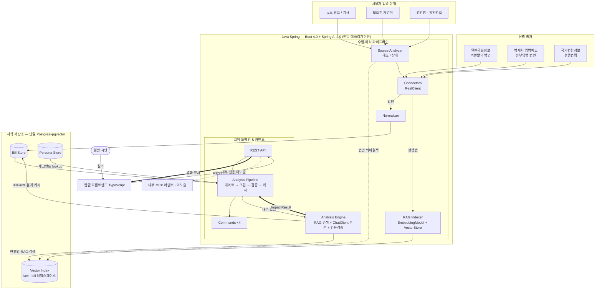

# 입법 영향 분석기 (LIA · Legislative Impact Analyzer) — 아키텍처 설계

> 입법 예정인 법안이 **나에게 어떤 변화를 주는지, 무엇을 해야 하는지**를
> 일반 시민의 언어로 알려주는 **웹앱** 서비스.

문서 버전 0.6 · 2026-07-21 · 상태: **현행(latest)**

> 변경 이력과 버전별 설계 이유는 [`../ARCHITECTURE.md`](../ARCHITECTURE.md) 색인 참고.
> 이 파일은 v0.6 시점의 **동결 스냅샷**이다. 수정하지 말 것 — 새 버전은 새 파일로.
> 컴포넌트 상세는 [`../components/component-specs.md`](../components/component-specs.md), 결정 이력은 [`../adr/decision-log.md`](../adr/decision-log.md), 버전 변경점은 [`../reference/spring-migration.md`](../reference/spring-migration.md).

---

## 1. 한 줄 정의와 설계 원칙

참고한 `korean-law-mcp`는 **이미 시행 중인 현행 법령**을 다룬다. 우리 차별점은 **아직 시행 전인 법안**을 다루고, *특정 사용자에게 미칠 영향*과 *대처 행동*으로 번역한다는 점이다.

네 가지 원칙(불변): ① **신뢰 출처 그라운딩** — 모든 주장에 조문 `source_id` 인용, 없으면 차단. ② **수집과 해석의 분리.** ③ **확장 = 커맨드·커넥터 추가**(개방-폐쇄). ④ **입력 다양성** — 식별자·기사·모호 자연어 모두 "법안 식별" 정규 흐름으로 수렴.

---

## 2. 전체 구조 (2-런타임)

**v0.5까지의 3-런타임(Python 파이프라인/Spring 코어/TS 웹)을 2-런타임으로 통합**했다.

- **Java Spring (Boot 4.0 + Spring AI 2.0) — 수집·해석 파이프라인 + 코어 도메인 + REST API.** 커넥터·식별·정규화·임베딩 적재·RAG 검색·LLM 추론·커맨드 오케스트레이션을 한 애플리케이션에서. Spring AI가 `ChatClient`(Anthropic)·`EmbeddingModel`(OpenAI-호환)·`VectorStore`(PgVector)를 제공한다.
- **TypeScript — 웹 프론트엔드.** 일반 시민의 유일한 사용자 경로. MCP 어댑터는 내부 전용(사용자 미노출).

> **통합 근거(D35).** Python을 뒀던 이유는 "무거운 NLP·LLM·RAG 생태계"였으나, 자체 학습 없음(D05)·추론=Claude API(D19)·임베딩=외부 API(D32)·저장=단일 pgvector(D04)로 그 전제가 소멸했다. 파이프라인의 실체는 *HTTP 호출+파싱+오케스트레이션*이며, 이는 Spring의 본령이다. 이 경로는 v0.2 스택 결정 박스가 "Spring AI로 JVM 흡수 여지"로 예약해 뒀던 것이다. 운영 효과: 배포 런타임 3→2, Python↔Spring REST 계약 소멸(내부 호출), pydantic/Java 이중 도메인 모델 단일화.

**v0.5 대비 변화:** 파이프라인(①)과 코어(③)가 **하나의 Spring 애플리케이션** 안의 모듈이 됐고, `K3 → C4`가 REST가 아니라 **내부 메서드 호출**이다. 컴포넌트 경계·책임(수집↔해석 분리, 적재↔검색 분리)은 논리적으로 유지된다.

---

## 3. 파이프라인 (Spring)

### 3.1 신뢰 출처·커넥터 (v0.5와 동일 논리)
열린국회(의원발의, `AGE` 필수)·법제처 입법예고(정부입법, OC 인증)·국가법령정보(현행법, OC 인증). `SourceConnector` 인터페이스 구현체 추가 = 출처 확장(하류 무수정). 구현: Boot `RestClient`.

### 3.2 도메인 모델
`Bill`/`Article`/`BillFacts`(Layer A 캐시)/`ImpactResult`(Layer B). **Java 단일 정의**(pydantic 이중 정의 해소). 전체 속성: [`../reference/bill-attributes.md`](../reference/bill-attributes.md).

### 3.3 소스 입력 해소 — 4상태 (불변)
`RESOLVED / AMBIGUOUS / NOT_FOUND_YET / UNVERIFIED`, fail-closed. 정확·퍼지 매칭 + 법안 의미검색(탐색 네임스페이스). LLM은 식별자(resolver)일 뿐.

### 3.4 RAG·임베딩·추론 (Spring AI 매핑)
- **임베딩**: `EmbeddingModel` — 외부 API(D32), Upstage는 OpenAI-호환 base-url. 적재·검색 동일 모델.
- **적재**: RAG Indexer → `VectorStore`(PgVector). 두 네임스페이스(law=분석용/bill=탐색용)는 메타데이터 필터.
- **추론**: `ChatClient`(Anthropic, Opus 4.8) + 구조화 출력 → `ImpactResult`. 옵션은 빌더 패턴(2.0 강제).
- **2계층**(사실 A/해석 B)·**인용검증 게이트** 불변.

---

## 4. 커맨드 구조 (불변)

MVP 4종(`ImpactSummary`/`LawDiff`/`PersonaImpact`/`ActionPlan`), `CommandRegistry` 자동 발견, `AnalysisPipeline`이 해소 게이트→requirements→실행→검증→캐시. 페르소나=Nemotron 파생 세그먼트 lookup. Triage 기준 고정([`../reference/triage-policy.md`](../reference/triage-policy.md)), 라우팅 스테이지는 post-MVP.

---

## 5. 사용자 표면 (불변)

웹앱 단일 주 경로(TS → Spring REST `/api/v1/...`). MCP 어댑터는 내부 전용·미노출 — Spring AI 2.0은 MCP 어노테이션을 코어에 내장하므로 필요 시 같은 애플리케이션에서 활성화 가능(노출 여부는 별도 결정, 기존 방침 유지).

---

## 6. 운영 관점

- 배포 단위: **Spring 1 + 웹 1** (+Postgres). 관측성·배포 파이프라인 부담 축소.
- Python↔Spring REST 계약(§구 component-specs §3.1) 소멸 — 스키마는 내부 DTO로 승계(`injected_source_ids` 포함).
- 기존 Python 파이프라인 코드는 **포팅 사양·임베딩 벤치 도구**로 보존(운영 경로 아님).
- 버전 리스크: Boot 4.0·Spring AI 2.0은 GA 직후 — 패치 추적 필요([`../reference/spring-migration.md`](../reference/spring-migration.md) §4).

---

## 7. 다음 단계

1. core에 Boot 4.0 + Spring AI 2.0 골격 + Python 커넥터/SourceAnalyzer 포팅(테스트 케이스 승계).
2. Normalizer(신구조문대비표 파서) → Embedder/RAGIndexer(Spring AI) → 임베딩 벤치(OpenAI vs Upstage — 벤치 스크립트는 Python 유지 가능).
3. 수직 슬라이스: 수집 → 정규화 → 4종 커맨드 → 웹 표시.
