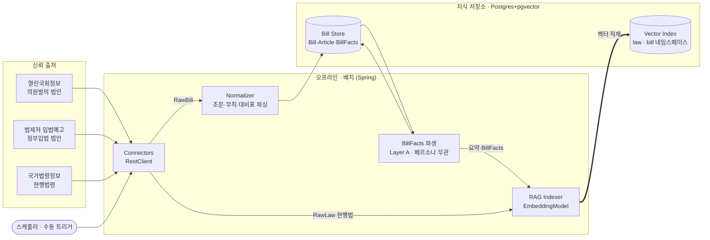
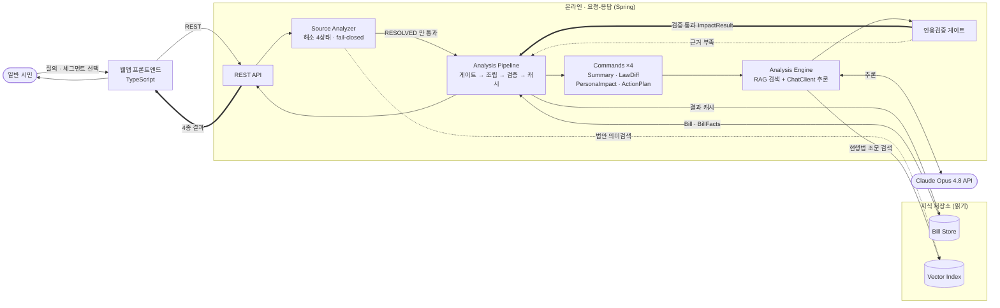

# 입법 영향 분석기 (LIA · Legislative Impact Analyzer) — 아키텍처 설계

> 입법 예정인 법안이 **나에게 어떤 변화를 주는지, 무엇을 해야 하는지**를
> 일반 시민의 언어로 알려주는 **웹앱** 서비스.

문서 버전 0.7 · 2026-08-01 · 상태: **현행(latest)**

> 변경 이력과 버전별 설계 이유는 [`../ARCHITECTURE.md`](../ARCHITECTURE.md) 색인 참고.
> 이 파일은 v0.7 시점의 **동결 스냅샷**이다. 수정하지 말 것 — 새 버전은 새 파일로.
> 컴포넌트 상세는 [`../components/component-specs.md`](../components/component-specs.md), 결정 이력은 [`../adr/decision-log.md`](../adr/decision-log.md).

---

## 1. 한 줄 정의와 설계 원칙

참고한 `korean-law-mcp`는 **이미 시행 중인 현행 법령**을 다룬다. 우리 차별점은 **아직 시행 전인 법안**을 다루고, *특정 사용자에게 미칠 영향*과 *대처 행동*으로 번역한다는 점이다.

네 가지 원칙(불변): ① **신뢰 출처 그라운딩** — 모든 주장에 조문 `source_id` 인용, 없으면 차단. ② **수집과 해석의 분리.** ③ **확장 = 커맨드·커넥터 추가**(개방-폐쇄). ④ **입력 다양성** — 식별자·기사·모호 자연어 모두 "법안 식별" 정규 흐름으로 수렴.

---

## 2. 실행 모드 — 오프라인 / 온라인 (v0.7 핵심)

같은 애플리케이션(Spring 단일, D35) 안이지만 **두 실행 모드는 성격이 전혀 다르다.** v0.6까지는 한 그림에 섞여 있어 "무엇이 사용자를 기다리게 하는가"가 드러나지 않았다.

| | **오프라인 (배치·적재)** | **온라인 (요청-응답)** |
|---|---|---|
| 계기 | 스케줄러·수동 트리거 | 사용자 HTTP 요청 |
| 지연 요구 | 없음 (분~시간 단위 허용) | **초 단위** — 사용자가 대기 |
| 실패 처리 | 재시도·다음 주기 | 즉시 응답(4상태 안내·폴백) |
| 외부 의존 | 출처 API, 임베딩 API | 임베딩 API(쿼리), **LLM API** |
| 상태 | 저장소를 **채운다**(write) | 저장소를 **읽는다**(read) + 결과 캐시 write |
| 확장 축 | 코퍼스 크기 | 동시 사용자 수 |
| 장애 영향 | 데이터 신선도 저하(서비스는 동작) | **사용자 직접 영향** |

**설계 함의:** 온라인 경로에 새 작업을 넣을 때는 "이건 오프라인으로 미리 할 수 없나?"를 먼저 묻는다. 임베딩 적재·BillFacts 파생(Layer A)이 오프라인에 있는 이유가 이것이다 — 온라인은 *검색 + 개인화 추론*만 남긴다.

---

## 3. 전체 구조

- **Java Spring (Boot 4.0 + Spring AI 2.0)** — 수집·해석 파이프라인 + 코어 도메인 + REST API. 오프라인·온라인 양쪽 모두 이 애플리케이션에서 실행된다(모드는 논리적 구분이지 배포 분리가 아니다).
- **TypeScript** — 웹 프론트엔드. 일반 시민의 유일한 사용자 경로. MCP 어댑터는 내부 전용(미노출).

### 3.1 오프라인 — 수집·적재 파이프라인

**흐름:** 스케줄러가 커넥터를 돌려 법안·현행법을 가져오고, 법안은 Normalizer로 표준화해 Bill Store에, 현행법은 임베딩해 Vector Index(`law` ns)에 적재한다. 적재된 법안에 대해 **BillFacts(Layer A 사실 파생)** 를 미리 만들어 두고, 그 요약을 다시 임베딩해 탐색용(`bill` ns)에 넣는다.

**미리 해두는 이유:** ① 임베딩·LLM 호출이 느리고 비용이 든다 ② 페르소나와 무관해 **한 번 만들면 모든 사용자가 재사용**한다 ③ 온라인 경로를 검색+개인화만 남겨 응답을 짧게 유지한다.

### 3.2 온라인 — 요청·응답 경로

**흐름:** 사용자 입력을 SourceAnalyzer가 해소(4상태)하고 **`RESOLVED`만 분석으로 넘긴다.** Pipeline이 Bill·BillFacts(오프라인 산출)와 세그먼트를 조립해 커맨드를 실행하고, Engine이 현행법을 RAG 검색해 Opus로 추론한다. **인용검증 게이트**를 통과한 결과만 사용자에게 나가고, 근거 부족이면 폴백한다.

**세그먼트 입력:** 사용자가 화면에서 자신에게 해당하는 세그먼트를 고른다(또는 자유 입력). Nemotron 기반 **자동 군집(Persona Builder)은 post-MVP**이므로 이 그림에 없다 — 세그먼트 프로파일은 초기에 수작업으로 정의한다.

---

## 4. 파이프라인 상세

### 4.1 신뢰 출처·커넥터 (오프라인)
열린국회(의원발의, **`AGE` 필수**)·법제처 입법예고(정부입법, OC 인증)·국가법령정보(현행법, OC 인증). `SourceConnector` 구현체 추가 = 출처 확장(하류 무수정).

> **실측 상태(2026-08-01):** 열린국회는 **메타데이터만 제공** — 법안 본문(조문·부칙·신구조문대비표) 획득 경로 미확정(**D38**). 반면 국가법령정보는 조문·부칙 본문을 완전히 제공한다. 따라서 §4.2 Normalizer의 본문 파싱은 경로 확정 후 활성화된다.

### 4.2 도메인 모델
`Bill`/`Article`/`BillFacts`(Layer A 캐시)/`ImpactResult`(Layer B). 전체 속성은 [`../reference/bill-attributes.md`](../reference/bill-attributes.md), 타입은 [`../components/component-specs.md`](../components/component-specs.md) §1.

### 4.3 해소 4상태 (온라인, 불변)
`RESOLVED / AMBIGUOUS / NOT_FOUND_YET / UNVERIFIED`, **fail-closed** — 신뢰 출처에서 확인되지 않으면 분석하지 않는다. 미등록(`NOT_FOUND_YET`)과 허위 의심(`UNVERIFIED`)은 안내 문구가 다르다.

### 4.4 RAG — 두 용도, 두 시점
| 용도 | 네임스페이스 | 적재(오프라인) | 검색(온라인) |
|---|---|---|---|
| **분석용** | `law` | 현행법 조문 | Analysis Engine — diff·영향 근거 |
| **탐색용** | `bill` | 법안 요약·BillFacts | Source Analyzer — 모호 질의 → 후보 |

**적재·검색은 반드시 동일 임베딩 모델**(공유 `Embedder`). 법안 *전문*은 임베딩하지 않는다(분석 시 컨텍스트에 통째로 들어감).

### 4.5 추론·검증
`ChatClient`(Anthropic Opus 4.8) + 구조화 출력 → `ImpactResult`. **명시적 워크플로**로 구현하며 에이전트 프레임워크를 쓰지 않는다(**D37**). 모든 claim은 주입된 `source_id`만 인용 가능하고, 검증 실패 시 재생성(≤N) 후 폴백한다.

---

## 5. 커맨드 구조

MVP 4종 — `ImpactSummary` / `LawDiff` / `PersonaImpact` / `ActionPlan`. `CommandRegistry` 자동 발견, `AnalysisPipeline`이 해소 게이트 → `requirements()` 충족 → 실행 → 검증 → 캐시.

**2계층:** Layer A(법안 사실·BillFacts — **오프라인 선계산**) → Layer B(`PersonaImpact`·`ActionPlan` — 온라인, 세그먼트별). Triage 분류 기준은 고정([`../reference/triage-policy.md`](../reference/triage-policy.md)), 차등 라우팅 스테이지는 post-MVP.

---

## 6. 사용자 표면

웹앱 단일 주 경로(TS → Spring REST `/api/v1/...`). 결과 4종(요약 / 무엇이 바뀌나 / 내 영향 / 대응안)을 **인용과 함께** 표시하고 법률자문이 아님을 명시한다. MCP 어댑터는 내부 전용·미노출.

---

## 7. 운영 관점

- **배포 단위:** Spring 1 + 웹 1 (+Postgres). 오프라인·온라인은 같은 애플리케이션의 논리적 모드다 — 부하가 커지면 오프라인을 별도 인스턴스/스케줄러로 떼어낼 수 있으나 현 단계에선 불필요.
- **비용 동인:** 저장 용량이 아니라 *띄워 둔 인스턴스 + 런타임 LLM 호출*(ADR-001). 오프라인 선계산(BillFacts·임베딩)과 결과 캐시가 온라인 LLM 호출을 줄이는 핵심 레버.
- **메모리:** 벡터 저장·HNSW 검색은 Postgres, 임베딩·추론은 외부 API — JVM은 HTTP·파싱·조립만 담당한다(**D39**).
- **미해결:** 법안 본문 획득 경로(**D38**) — MVP 필수 관문.

---

## 8. 다음 단계

1. **Normalizer**(신구조문대비표 파서) — 본문 경로 확정 후 Phase 2까지.
2. **LawConnector / MolegConnector** — 현행법은 응답 형식 실측 완료.
3. **Embedder / RAGIndexer**(Spring AI) → **임베딩 벤치**(OpenAI vs Upstage).
4. **수직 슬라이스**: 수집 → 정규화 → 4종 커맨드 → 웹 표시.
