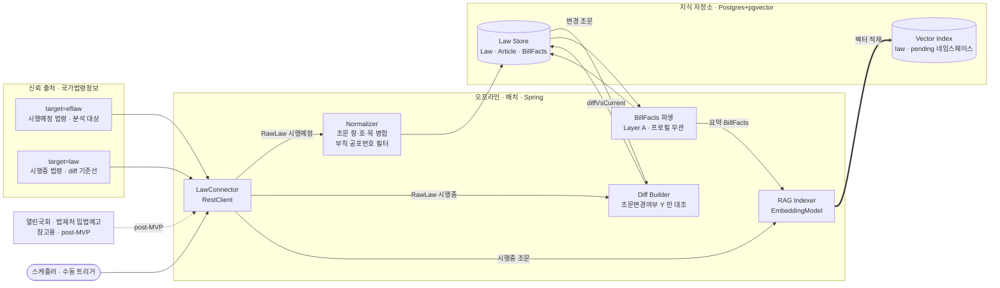
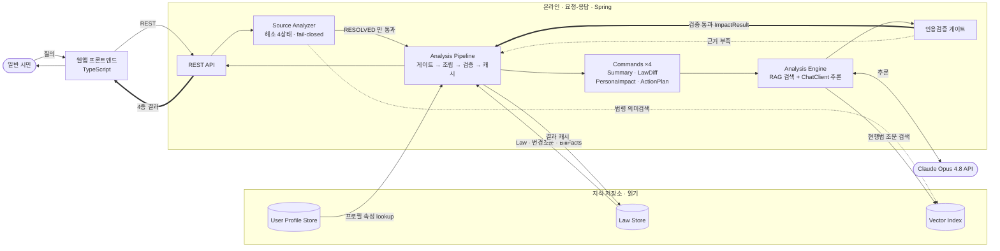

# 입법 영향 분석기 (LIA · Legislative Impact Analyzer) — 아키텍처 설계

> 곧 시행될 법령이 **나에게 어떤 변화를 주는지, 무엇을 해야 하는지**를
> 일반 시민의 언어로 알려주는 **웹앱** 서비스.

문서 버전 0.8 · 2026-08-02 · 상태: **현행(latest)**

> 변경 이력과 버전별 설계 이유는 [`../ARCHITECTURE.md`](../ARCHITECTURE.md) 색인 참고.
> 이 파일은 v0.8 시점의 **동결 스냅샷**이다. 수정하지 말 것 — 새 버전은 새 파일로.
> 컴포넌트 상세는 [`../components/component-specs.md`](../components/component-specs.md), 결정 이력은 [`../adr/decision-log.md`](../adr/decision-log.md).

---

## 1. 한 줄 정의와 설계 원칙

참고한 `korean-law-mcp`는 **이미 시행 중인 현행 법령**을 다룬다. 우리 차별점은 **아직 시행되지 않은 법령**을 다루고, *특정 사용자에게 미칠 영향*과 *대처 행동*으로 번역한다는 점이다.

네 가지 원칙(불변): ① **신뢰 출처 그라운딩** — 모든 주장에 조문 `source_id` 인용, 없으면 차단. ② **수집과 해석의 분리.** ③ **확장 = 커맨드·커넥터 추가**(개방-폐쇄). ④ **입력 다양성** — 식별자·기사·모호 자연어 모두 "법령 식별" 정규 흐름으로 수렴.

---

## 2. 분석 대상 = 공포 후 시행 대기 법령 (v0.8 핵심)

v0.7까지는 분석 대상이 **의안(법안)** 이었다. v0.8은 이를 **공포됐으나 아직 시행되지 않은 법령**으로 좁힌다(**D42**).

| | 의원발의 의안 | 정부 입법예고 | **공포 후 시행 대기 법령** |
|---|---|---|---|
| 적용 확실성 | **~20%** | 높음 | **100% 확정** |
| 본문 확보 | ❌ HWP 첨부만 | 개정이유·주요내용만 | ✅ **조문 전문·개정문·부칙** |
| 시행일 | 미정 | 미정 | ✅ **확정일** |
| MVP 지위 | 참고용 | post-MVP | **분석 대상** |

**왜 이 축인가.** 서비스 약속은 "*적용될 법이 나에게 무엇을 바꾸는가*"다. 통과 여부가 불확실한 의안을 분석하면 사용자에게 *일어나지 않을 일*을 알리게 된다. 시행 대기 법령은 **불확실성이 0이고 시행일이 확정**돼 있어 `ActionPlan`("언제까지 무엇을 하라")이 비로소 단정적으로 성립한다.

**부수 효과 — 본문 갭(D38) 소멸.** 의안 경로에서 미해결이던 본문 획득이, 이미 연동된 국가법령정보에서 **전문·개정문·제개정이유·부칙 전부** 제공되면서 해결됐다. HWP 파서·신구조문대비표 파싱이 모두 불필요해졌다.

### 2.1 두 실행 모드 (v0.7에서 승계, 불변)

| | **오프라인 (배치·적재)** | **온라인 (요청-응답)** |
|---|---|---|
| 계기 | 스케줄러·수동 트리거 | 사용자 HTTP 요청 |
| 지연 요구 | 없음 (분~시간 단위 허용) | **초 단위** — 사용자가 대기 |
| 실패 처리 | 재시도·다음 주기 | 즉시 응답, 4상태 안내·폴백 |
| 외부 의존 | 출처 API, 임베딩 API | 임베딩 API(쿼리), **LLM API** |
| 상태 | 저장소를 **채운다**(write) | 저장소를 **읽는다**(read) + 결과 캐시 write |
| 확장 축 | 코퍼스 크기 | 동시 사용자 수 |
| 장애 영향 | 데이터 신선도 저하(서비스는 동작) | **사용자 직접 영향** |

**설계 함의:** 온라인 경로에 새 작업을 넣기 전에 "이건 오프라인으로 미리 할 수 없나?"를 먼저 묻는다. v0.8에서는 **조문 대조(diff)까지 오프라인으로 내렸다** — 프로필과 무관한 사실이므로 모든 사용자가 재사용한다.

---

## 3. 전체 구조

- **Java Spring (Boot 4.0 + Spring AI 2.0)** — 수집·해석 파이프라인 + 코어 도메인 + REST API. 오프라인·온라인 양쪽 모두 이 애플리케이션에서 실행된다(모드는 논리적 구분이지 배포 분리가 아니다).
- **TypeScript** — 웹 프론트엔드. 일반 시민의 유일한 사용자 경로. MCP 어댑터는 내부 전용(미노출).

### 3.1 오프라인 — 수집·적재 파이프라인



**흐름:** 스케줄러가 `LawConnector`로 **시행예정 목록**을 가져온다(`efYd` 범위 필터, 실측 899건). 각 건의 본문을 받아 Normalizer가 조문·부칙을 표준화해 Law Store에 넣고, **같은 `법령ID`의 시행중본**을 끌어와 `조문변경여부='Y'` 조문만 대조해 `diffVsCurrent`를 채운다. 그 위에서 BillFacts(Layer A 사실)를 파생하고, 시행중 조문과 BillFacts 요약을 각각 임베딩해 Vector Index에 적재한다.

**미리 해두는 이유:** ① 임베딩·LLM 호출이 느리고 비용이 든다 ② **사용자 프로필과 무관**해 한 번 만들면 모든 사용자가 재사용한다 ③ 온라인 경로를 검색+개인화만 남겨 응답을 짧게 유지한다.

### 3.2 온라인 — 요청·응답 경로



**흐름:** 사용자 입력을 SourceAnalyzer가 해소(4상태)하고 **`RESOLVED`만 분석으로 넘긴다.** Pipeline이 Law·변경조문·BillFacts(오프라인 산출)와 **자기신고 프로필**(D41)을 조립해 커맨드를 실행하고, Engine이 현행법을 RAG 검색해 Opus로 추론한다. **인용검증 게이트**를 통과한 결과만 사용자에게 나가고, 근거 부족이면 폴백한다.

**프로필 입력(D41):** 회원가입 시 받은 자기신고 속성(이용 목적·만 나이·직업군·고용형태·가구·주거·시도)을 `userId`로 lookup한다. **성명 등 직접식별정보는 수집하지 않는다.** Nemotron 기반 자동 군집은 폐기됐다. 캐시 키는 `userId`가 아니라 **프로필 속성 해시**다.

---

## 4. 파이프라인 상세

### 4.1 신뢰 출처·커넥터 (오프라인)

**MVP는 국가법령정보 단일 출처**, OC 인증. `LawConnector` 하나가 target 2개를 담당한다 — `eflaw`와 `law`는 응답 스키마가 동일하다.

```
listPending(from, to)   target=eflaw + efYd 범위  → 시행예정 목록
fetchPending(mst, efYd) target=eflaw + MST        → 시행예정 본문
fetchCurrent(lawId)     target=law   + ID         → 시행중 본문 · diff 기준선
```

응답: `법령 > {기본정보, 조문, 부칙, 개정문, 제개정이유}`

> **연결키는 `법령ID`다.** `MST`(법령일련번호)는 버전마다 달라 시행중↔시행예정 연결에 쓸 수 없다.
> **실측 함정 3가지:** ① `조문내용`만 읽으면 본문이 빈다 — 실제 내용은 `항→호→목` 중첩, **재귀 병합 필수** ② `기본정보.소관부처` 등이 중첩 객체 — 평탄화 필요 ③ 부칙은 이력 전체(42개)가 오므로 `부칙공포번호 == 공포번호`로 필터.
> 상세·재현: [`../components/SourceConnector.md`](../components/SourceConnector.md) §MVP 본문 경로 · `tools/probe_eflaw.py`

열린국회(의원발의)·법제처 입법예고는 **커넥터 인터페이스는 유지하되 분석 대상에서 제외**한다(post-MVP). 확장 = 구현체 추가라는 개방-폐쇄 구조는 그대로다.

### 4.2 도메인 모델 (D42로 개정)

**`Law`**(MVP 분석 대상) / `Article` / `BillFacts`(Layer A 캐시) / `ImpactResult`(Layer B). **`Bill`(의안)은 post-MVP로 보류** — `eflaw` 응답에 `billNo`·발의자·소관위·심사단계가 없어 `Bill`을 쓰면 절반이 항상 null이다. 타입은 [`../components/component-specs.md`](../components/component-specs.md) §1.1.

### 4.3 해소 4상태 (온라인, 불변)

`RESOLVED / AMBIGUOUS / NOT_FOUND_YET / UNVERIFIED`, **fail-closed** — 신뢰 출처에서 확인되지 않으면 분석하지 않는다. 미등록(`NOT_FOUND_YET`)과 허위 의심(`UNVERIFIED`)은 안내 문구가 다르다.

### 4.4 LawDiff — 조문 대조 (v0.8에서 단순화)

```
시행예정본 target=eflaw&MST=   ─┐
                               ├─ 같은 조문번호로 대조 → diffVsCurrent
시행중본   target=law&ID=      ─┘
```

- **대상 선별:** `조문변경여부='Y'` 플래그가 변경 조문을 직접 지목한다. 실측(주택법) **137개 중 6개** — 분석 토큰이 20분의 1로 줄어든다.
- **정렬(alignment) 문제 소멸:** 두 버전이 동일 스키마·동일 조문번호이므로 조문번호가 곧 정렬키다. v0.7까지 Open이던 과제가 없어졌다.
- **`개정문` 정규식 파싱 금지:** 실측에서 타법 인용 조문번호를 오탐하고 벌칙·과태료 조문을 누락했다. **플래그가 정답**이고 `개정문`은 사람이 읽을 근거 텍스트로만 인용한다.
- **시행 시점:** `부칙` 제1조에서 `effectiveRule`·`enforcementType`을 얻는다 — 예: *"공포 후 6개월이 경과한 날부터 시행한다. 다만 …개정규정은 공포한 날부터 시행한다"* → `단계적`.

### 4.5 RAG — 두 용도, 두 시점

| 용도 | 네임스페이스 | 적재(오프라인) | 검색(온라인) |
|---|---|---|---|
| **분석용** | `law` | 시행중 법령 조문 | Analysis Engine — diff·영향 근거 |
| **탐색용** | `pending` | 시행예정 법령 요약·BillFacts | Source Analyzer — 모호 질의 → 후보 |

**적재·검색은 반드시 동일 임베딩 모델**(공유 `Embedder`). 법령 *전문*은 임베딩하지 않는다(분석 시 컨텍스트에 통째로 들어감).

> 탐색용 네임스페이스는 v0.7의 `bill`에서 `pending`으로 개명한다(대상이 의안이 아니라 시행예정 법령). `BillFacts` 타입명은 이력상 유지한다.

### 4.6 추론·검증

`ChatClient`(Anthropic Opus 4.8) + 구조화 출력 → `ImpactResult`. **명시적 워크플로**로 구현하며 에이전트 프레임워크를 쓰지 않는다(**D37**). 모든 claim은 주입된 `source_id`만 인용 가능하고, 검증 실패 시 재생성(≤N) 후 폴백한다.

---

## 5. 커맨드 구조

MVP 4종 — `ImpactSummary` / `LawDiff` / `PersonaImpact` / `ActionPlan`. `CommandRegistry` 자동 발견, `AnalysisPipeline`이 해소 게이트 → `requirements()` 충족 → 실행 → 검증 → 캐시.

**2계층:** Layer A(법령 사실·BillFacts·조문 diff — **오프라인 선계산**) → Layer B(`PersonaImpact`·`ActionPlan` — 온라인, 프로필별). Triage 분류 기준은 고정([`../reference/triage-policy.md`](../reference/triage-policy.md)), 차등 라우팅 스테이지는 post-MVP.

---

## 6. 사용자 표면

웹앱 단일 주 경로(TS → Spring REST `/api/v1/...`). 결과 4종(요약 / 무엇이 바뀌나 / 내 영향 / 대응안)을 **인용·시행일과 함께** 표시하고 법률자문이 아님을 명시한다. 회원가입 시 자기신고 프로필을 입력받으며 전부 선택 항목이다(D41). MCP 어댑터는 내부 전용·미노출.

---

## 7. 운영 관점

- **배포 단위:** Spring 1 + 웹 1 (+Postgres). 오프라인·온라인은 같은 애플리케이션의 논리적 모드다 — 부하가 커지면 오프라인을 별도 인스턴스/스케줄러로 떼어낼 수 있으나 현 단계에선 불필요.
- **코퍼스 규모:** 시행예정 **899건**(2026-08-02~2027-12-31 실측). ADR-001 용량 가정 안쪽이며 저장소 결정은 불변.
- **비용 동인:** 저장 용량이 아니라 *띄워 둔 인스턴스 + 런타임 LLM 호출*(ADR-001). 오프라인 선계산(diff·BillFacts·임베딩)과 결과 캐시가 온라인 LLM 호출을 줄이는 핵심 레버. **`조문변경여부` 필터가 여기에 직접 기여**한다.
- **메모리:** 벡터 저장·HNSW 검색은 Postgres, 임베딩·추론은 외부 API — JVM은 HTTP·파싱·조립만 담당한다(**D39**).
- **개인정보:** 직접식별정보 미수집이나 "개인정보 아님"은 아니다 — 처리방침·동의·파기 절차 필요(D41).
- **미해결:** 한 법령에 시행예정본이 복수일 때의 diff 기준 시점(**D43**). 실측에서 주택법은 현행본 공포 제21447호(2026-03-05)인데 시행예정본이 제21323호(2026-02-03)로, *나중에 공포된 쪽이 먼저 시행*됐다.

---

## 8. 다음 단계

1. **LawConnector** — `eflaw` 목록·본문 + `law` 기준선 (이슈 #11).
2. **Normalizer** — 조문 `항/호/목` 재귀 병합, 부칙 공포번호 필터, `조문변경여부` 매핑 (이슈 #5).
3. **Diff Builder** — 변경 조문만 시행중본과 대조.
4. **Embedder / RAGIndexer**(Spring AI) → **임베딩 벤치**(OpenAI vs Upstage). 시나리오 A 정답쌍은 `개정문`+조문대조에서 생성.
5. **수직 슬라이스**: 수집 → 정규화 → diff → 4종 커맨드 → 웹 표시.
