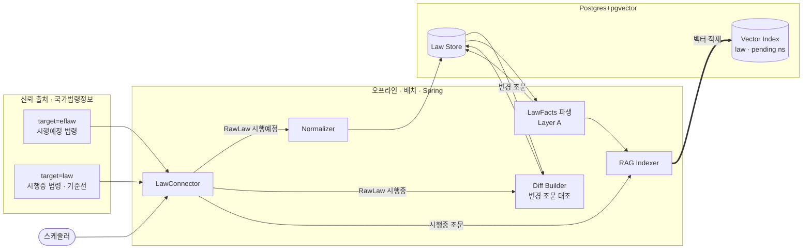
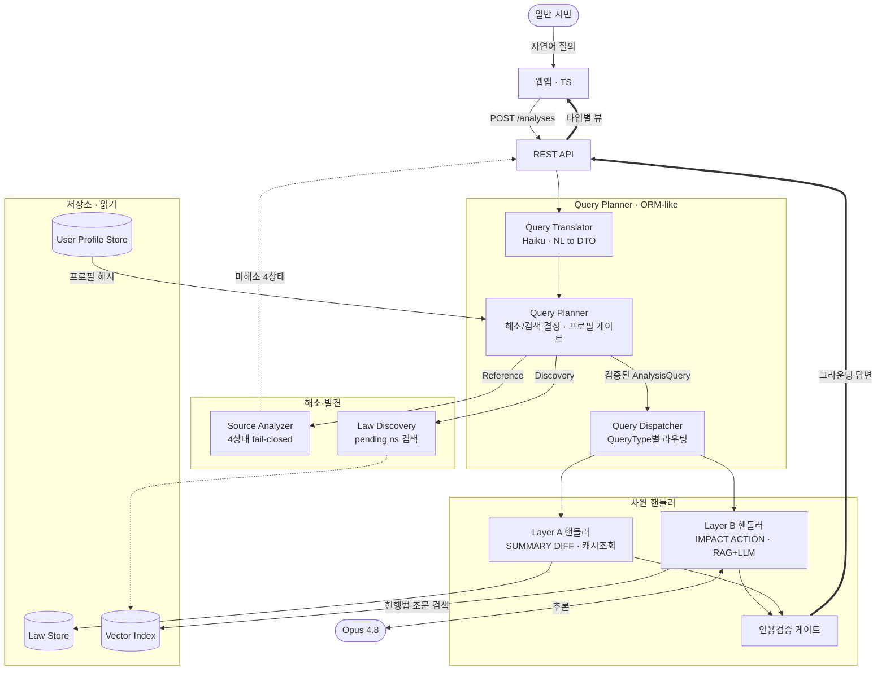

# 입법 영향 분석기 (LIA · Legislative Impact Analyzer) — 아키텍처 설계

> 곧 시행될 법령이 **나에게 어떤 변화를 주는지, 무엇을 해야 하는지**를
> 일반 시민의 언어로 알려주는 **웹앱** 서비스.

문서 버전 0.9 · 2026-08-02 · 상태: **현행(latest)**

> 변경 이력과 버전별 설계 이유는 [`../ARCHITECTURE.md`](../ARCHITECTURE.md) 색인 참고.
> 이 파일은 v0.9 시점의 **동결 스냅샷**이다. 수정하지 말 것 — 새 버전은 새 파일로.
> 컴포넌트 상세는 [`../components/component-specs.md`](../components/component-specs.md)·[`../components/plan/QueryPlanner.md`](../components/plan/QueryPlanner.md), 결정 이력은 [`../adr/decision-log.md`](../adr/decision-log.md).

---

## 1. 한 줄 정의와 설계 원칙

우리 차별점은 **아직 시행되지 않은 법령**을 다루고, *특정 사용자에게 미칠 영향*과 *대처 행동*으로 번역한다는 점이다.

네 가지 원칙(불변): ① **신뢰 출처 그라운딩** — 모든 주장에 조문 `source_id` 인용, 없으면 차단. ② **수집과 해석의 분리.** ③ **확장 = 커맨드·커넥터 추가**(개방-폐쇄). ④ **입력 다양성** — 식별자·기사·모호 자연어 모두 "법령 식별" 정규 흐름으로 수렴.

---

## 2. v0.9 핵심 — 자연어 질의 · ORM-like 플래너

**사용자는 자연어로 자유롭게 묻는다**("주택법 바뀌면 나 전세 계약 어떻게 돼?", "나한테 영향 있을 법령 찾아줘"). v0.8까지 온라인 경로는 *해소→커맨드 실행*이었으나, 자연어 질의를 정면으로 받으려면 **"이 질문이 무엇을 요구하는가"를 먼저 구조화**해야 한다.

**ORM-like 접근(D46).** LLM을 **컴파일러/매퍼**로 써서 자연어를 **엄격한 타입 DTO(`AnalysisQuery`)** 로 번역하고, DTO의 타입이 검색·실행 전략(dispatch)을 결정한다. ORM이 표현식을 SQL로 번역하고 실행은 엔진이 결정론적으로 하듯, **자연어는 번역기 입구에서 끝나고 이후 제어 흐름은 고정**이다. 이것이 D37(에이전트 미도입, 명시적 워크플로)을 *강화*한다 — 자유 텍스트는 입력 가장자리에만 있고, 실행 경로는 설계 시점에 고정된다.

### 2.1 QueryType 5종

| QueryType | 종류 | 사용자 질문 | 검색 전략 | 계층 |
|---|---|---|---|---|
| **`LOOKUP`** | 발견 | "나한테 영향 있을 법령 찾아줘" | 코퍼스 검색(`pending` ns + 프로필/도메인) | — |
| `SUMMARY` | 분석 | "이 법이 대체 뭔데?" | Law Store 조회(캐시, RAG 불필요) | A |
| `DIFF` | 분석 | "뭐가 바뀌었어?" | 선계산 diff 캐시(RAG 불필요) | A |
| `IMPACT` | 분석 | "나한테 무슨 상관인데?" | Hybrid RAG + 프로필 | B |
| `ACTION` | 분석 | "뭘 해야 해? 언제까지?" | 부칙·시행일 + 프로필 | B |

한 질의는 **주 타입 1개 + 타입 집합**으로 매핑된다(포괄 질문이면 여럿). 분류를 엄격히 강요하지 않고 best-effort로 채워 graceful degrade한다.

### 2.2 Target 2형

- **`Reference`** — 질의가 법령을 지목(법령명/조문번호) → `SourceAnalyzer` 해소(4상태, fail-closed). `AMBIGUOUS`(시행예정본 복수, D43)면 시행일 선택 유도.
- **`Discovery`** — 특정 법령 없이 "찾아줘" → `LawDiscovery`가 코퍼스를 검색해 후보 N건 반환. 분석 타입이 함께면 top-K 팬아웃. 검색은 실재 법령만 반환(fail-closed).

### 2.3 두 실행 모드 (v0.7~v0.8 승계, 불변)

| | **오프라인 (배치·적재)** | **온라인 (요청-응답)** |
|---|---|---|
| 지연 요구 | 없음 | **초 단위** |
| 상태 | 저장소를 **채운다** | 저장소를 **읽는다** + 결과 캐시 |
| 장애 영향 | 데이터 신선도 저하 | **사용자 직접 영향** |

**설계 함의:** SUMMARY·DIFF(Layer A)는 오프라인 선계산·캐시라 온라인에선 조회다. 온라인 LLM 비용은 IMPACT·ACTION(Layer B)과 번역기에만 든다.

---

## 3. 전체 구조

- **Java Spring (Boot 4.0 + Spring AI 2.0)** — 오프라인·온라인 양쪽. **TypeScript** — 웹 프론트엔드. MCP 어댑터는 내부 전용(미노출).

### 3.1 오프라인 — 수집·적재 파이프라인 (v0.8과 동일)

### 3.2 온라인 — 자연어 질의 경로 (v0.9 핵심)

**흐름:** `POST /analyses`로 자연어가 들어오면 **Query Translator**가 `AnalysisQuery`(타입·엔티티·target)로 번역한다. **Query Planner**가 Reference면 `SourceAnalyzer`로 해소(미해소면 4상태로 즉시 반환, fail-closed), Discovery면 `LawDiscovery`로 검색한다. 프로필이 없으면 Layer B 차원을 제거(`unmet`). **Query Dispatcher**가 타입 집합을 핸들러로 라우팅한다 — SUMMARY·DIFF는 선계산 캐시 조회, IMPACT·ACTION은 RAG+Opus 추론. **인용검증 게이트** 통과분만 나가고, 프론트는 타입별 뷰로 렌더한다.

---

## 4. 파이프라인 상세

### 4.1 수집·정규화·diff (오프라인)
`LawConnector`(eflaw/law) → `Normalizer`(조문 병합·부칙 필터·`revision`) → `Diff Builder`(변경 조문 ↔ 시행중본 대조 → `diffVsCurrent`). 상세: [`../components/connector/SourceConnector.md`](../components/connector/SourceConnector.md)·[`../components/normalize/Normalizer.md`](../components/normalize/Normalizer.md).

### 4.2 도메인 모델
`Law`(분석 대상)/`Article`/`Addendum`/`LawFacts`(Layer A 캐시)/`ImpactResult`(Layer B). 질의 표현은 **`AnalysisQuery`**(+`QueryType`·`Target`). 타입: [`../components/component-specs.md`](../components/component-specs.md) §1.

### 4.3 Query Planner (온라인, v0.9 신설)
번역(`QueryTranslator`, Haiku) → 해소/발견 결정(`QueryPlanner`) → 라우팅(`QueryDispatcher`). 상세·시나리오: [`../components/plan/QueryPlanner.md`](../components/plan/QueryPlanner.md).

### 4.4 해소 4상태 (불변)
`RESOLVED / AMBIGUOUS / NOT_FOUND_YET / UNVERIFIED`, fail-closed. 미등록과 허위 의심은 안내가 다르다(D23).

### 4.5 LawDiff — 조문 대조 (v0.8과 동일)
`조문변경여부='Y'` 조문만 시행중본과 대조(실측 137개 중 6개). `개정문` 정규식 파싱 금지. 시행 시점은 부칙에서.

### 4.6 RAG — 두 용도
분석용(`law` ns, 시행중 조문) / 탐색용(`pending` ns, 시행예정 요약·LawFacts). **LOOKUP 발견도 `pending` ns를 쓴다.** 동일 임베딩 모델. 법령 전문은 임베딩하지 않음.

### 4.7 추론·검증
`ChatClient`(Opus 4.8) + 구조화 출력 → `ImpactResult`. 명시적 워크플로(D37). 인용검증 실패 시 재생성(≤N).

---

## 5. QueryType·차원 구조

MVP 5종 — `LOOKUP`(발견) + `SUMMARY`·`DIFF`(Layer A) + `IMPACT`·`ACTION`(Layer B). `QueryDispatcher`가 타입 집합을 핸들러로 라우팅한다(옛 `AnalysisPipeline`+`CommandRegistry` 승계). **커맨드는 사용자 선택 모드가 아니라 답변 구조·그라운딩 가드레일**이며 플래너가 질의에서 고른다.

**2계층:** Layer A(사실·diff·LawFacts — 오프라인 선계산) → Layer B(IMPACT·ACTION — 온라인, 프로필별). Triage 기준 고정([`../reference/triage-policy.md`](../reference/triage-policy.md)), 차등 라우팅은 post-MVP.

---

## 6. 사용자 표면

웹앱 단일 주 경로(TS → `POST /api/v1/analyses` 자연어). 공개 API·기능 명세: [`../mvp/service-api-spec.md`](../mvp/service-api-spec.md). 응답은 **타입별 뷰**로 렌더한다 — SUMMARY 요약 카드 / DIFF 신구 조문 대비 / IMPACT 영향 체크리스트 / ACTION 타임라인 / LOOKUP 후보 법령 리스트. 모든 주장에 **인용·시행일** + 법률자문 아님 면책. 프로필은 자기신고(D41). MCP 어댑터는 내부 전용·미노출.

---

## 7. 운영 관점

- **배포 단위:** Spring 1 + 웹 1 (+Postgres).
- **비용 동인:** 런타임 LLM 호출(ADR-001). 오프라인 선계산(diff·LawFacts·임베딩)·캐시 + **번역기 저비용 모델(Haiku)** 이 온라인 비용을 낮추는 레버. SUMMARY·DIFF는 캐시 조회라 LLM 비용 0.
- **번역 비용:** 질의당 Haiku 1회(추출·분류). Opus는 IMPACT·ACTION 생성에만.
- **미해결:** 시행예정본 복수 시 diff 기준 시점(D43). LOOKUP 팬아웃 정책(top-K 자동 분석 vs 후보만).

---

## 8. 다음 단계

1. **Diff Builder** — 변경 조문 ↔ 시행중본 대조.
2. **Query Planner** — `QueryTranslator`(Haiku)·`QueryPlanner`·`QueryDispatcher`·`AnalysisQuery`.
3. **Embedder / RAGIndexer** → 임베딩 벤치. `LawDiscovery`(pending ns 검색).
4. **AnalysisEngine** — 차원 핸들러 본체(RAG+Opus+인용검증).
5. **수직 슬라이스**: 자연어 질의 → 플래너 → 해소/검색 → 차원 → 타입별 웹 뷰.
