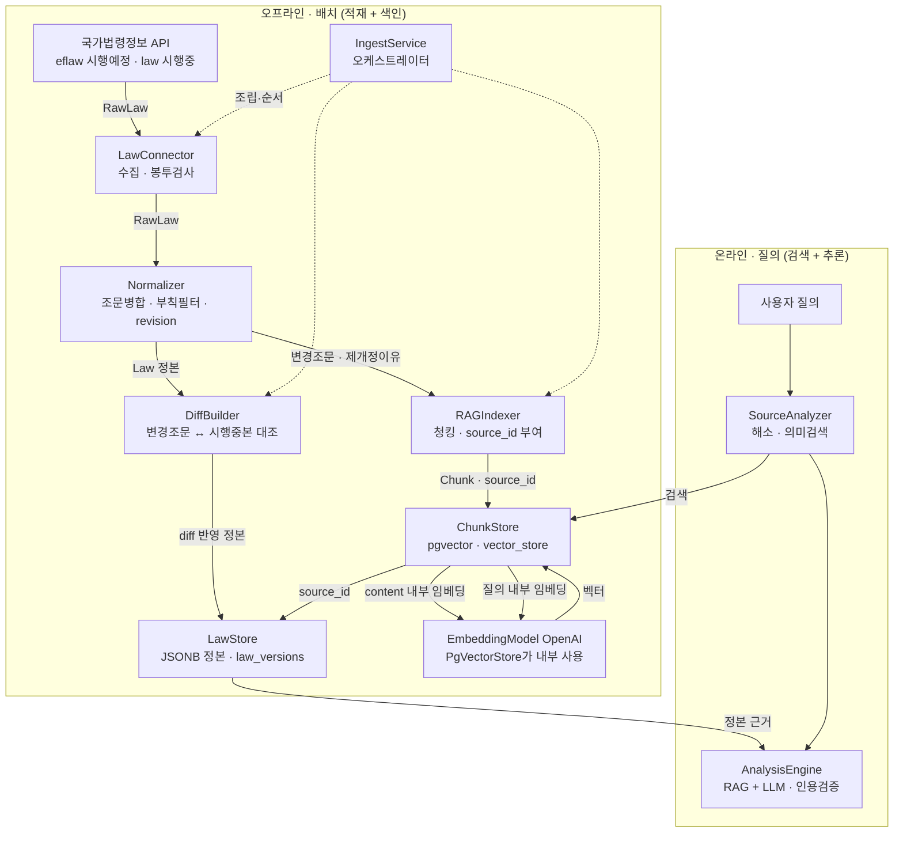

# RAG 파이프라인 구조 · 컴포넌트 역할 · 담당 파일

> LIA의 RAG는 **두 국면**으로 갈린다: **오프라인**(법령을 수집·정규화·대조해 정본 저장 + 변경 조문·요약을 임베딩해 벡터 색인)과 **온라인**(질의를 임베딩해 유사도 검색 → `source_id`로 정본을 되짚어 근거로 삼아 추론). 상세 계약은 각 [[component-specs|컴포넌트 스펙]], 여기서는 **전체 그림과 파일 소유**를 한눈에 본다.

## 1. 전체 구조



**두 저장소를 잇는 키 = `source_id`.** 검색은 벡터(`ChunkStore`)에서 후보를 찾고, 그 `source_id`로 정본(`LawStore`)을 되짚어 **인용 근거**로 쓴다(그라운딩). 벡터는 파생물이라 언제든 재생성 가능하고, 인용의 진실은 정본이다.

> **임베딩은 `ChunkStore` 안 PgVectorStore가 한다.** `add`(적재)·`similaritySearch`(질의) 모두 설정된 `EmbeddingModel`(OpenAI)로 내부 임베딩하므로 **적재·검색 동일 모델**이 자동 보장된다. RAGIndexer는 벡터를 만들지 않고 Chunk만 넘긴다. [[Embedder]] 포트는 이 핫패스 밖 — 모델·dim 고정과 eval 유틸용이며, PgVectorStore와 **같은 `EmbeddingModel` 빈**을 공유한다.

## 2. 왜 이렇게 나눴나 (핵심 개념)

- **JSONB 정본 (LawStore).** 법령 1버전을 통째로 JSONB 한 컬럼에 넣는다. `Law`는 우리가 저작하지 않는 **외부 권위 사실**이라 관계형으로 쪼개 정규화할 실익이 적고, 통째로 읽고 쓰는 불변 스냅샷으로 다루는 게 맞다. 정확 조회·diff 기준선·context 조립·인용은 여기서 나온다.
- **청킹 (RAGIndexer).** 임베딩 검색용으로 **변경 조문만**(전문 아님) + **제개정이유 요약**을 잘라 벡터화한다. `조문변경여부='Y'` 플래그가 변경 조문을 지목해 주택법 137조문 → 6조문으로 좁힌다(토큰·노이즈 절감). 조문 1개=1청크, 과대 조문만 오버랩 분할.
- **정본 ≠ 벡터, 소유자도 둘.** `LawStore`(`JdbcClient`+Flyway, JSONB)와 `ChunkStore`(`PgVectorStore`, 벡터)는 다른 라이브러리·다른 테이블이라 **분리**한다. 한 클래스에 두 영속 메커니즘을 섞지 않는다.
- **단일 네임스페이스 `pending`.** 시행중 조문은 색인하지 않는다 — 현행과 곧 바뀔 내용이 섞이면 검색 노이즈. 시행중본은 diff 기준선으로 정확 fetch만 한다.
- **적재·검색 동일 임베딩 모델.** `ChunkStore`의 PgVectorStore가 `add`·`similaritySearch`에 **같은 `EmbeddingModel`**을 써서, 인덱스↔쿼리 모델 불일치(가장 흔한 RAG 붕괴)를 구조적으로 차단. (`Embedder` 포트는 같은 모델을 공유하되 핫패스 밖 — 설정 핀·eval.)

## 3. 컴포넌트별 역할 · 담당 파일

> 상태: ✅ 구현됨 · 🟡 스펙 확정·구현 착수 · ⬜ 후속

### 오프라인 — 적재

| 컴포넌트 | 역할 | 담당 파일 (역할) | 상태 |
|---|---|---|---|
| **LawConnector** | 국가법령정보 OpenAPI 호출, 인증·페이징·응답 기벽 흡수. `eflaw`(시행예정=분석대상)·`law`(시행중=diff 기준선) | `pipeline/connector/LawConnector.java` 수집·재시도 · `LawEnvelope.java` 봉투 검사(오류 200 판별·`법령` 블록 유무) · `RawLaw.java` 출처 원형 DTO(ACL 바깥) · `LawApiException.java` 오류 타입 | ✅ |
| **Normalizer** | `RawLaw` → 표준 `Law`. 출처 기벽을 여기서 끝냄(ACL 안쪽) | `pipeline/normalize/Normalizer.java` 조문 항→호→목 재귀 병합·부칙 공포번호 필터·`effectiveRule`·`revision` 해시 · `domain/law/Law.java`·`Article.java`·`Addendum.java` 도메인 타입 | ✅ |
| **DiffBuilder** | 변경 조문 ↔ 시행중본 대조. 신설·삭제·이동 확정, `diffVsCurrent` 근거 텍스트 | `pipeline/diff/DiffBuilder.java` 조문번호 정렬 대조·기준선 null이면 전부 신설(제정) | ✅ |
| **LawStore** | **JSONB 정본** 저장·조회. `(lawId, effectiveDate)` 단위, baseline 조회 | `store/LawStore.java` `JdbcClient`+Jackson, upsert(ON CONFLICT)·find·findBaseline · `resources/db/migration/V1__law_versions.sql` 관계형 스키마(payload jsonb) | ✅ |

### 오프라인 — 색인

| 컴포넌트 | 역할 | 담당 파일 (역할) | 상태 |
|---|---|---|---|
| **RAGIndexer** | **청킹** — 변경 조문 + 제개정이유 요약을 잘라 `source_id` 부여 → ChunkStore에 적재(임베딩은 안 함) | `pipeline/index/RAGIndexer.java` 대상 선별·조문/요약 청킹·문자수 휴리스틱 과대 분할·`source_id`(`LAW:{lawId}@{efYd}:art:{no}`) | ✅ |
| **ChunkStore** | 벡터 chunks **upsert·검색**. `source_id` 멱등, pgvector. **content 내부 임베딩** | `store/ChunkStore.java` 포트 · `store/PgVectorChunkStore.java` `PgVectorStore` 래핑·`Chunk`↔`Document` 매핑·삭제후삽입 · `Chunk` 값타입 · `vector_store` 테이블은 PgVectorStore 소유 | ✅ |
| **Embedder** | 텍스트 → 1536차원 벡터. **RAG 핫패스 밖** — 모델·dim 고정 + 원시 임베딩 유틸(eval). PgVectorStore와 같은 EmbeddingModel 공유 | `pipeline/embed/Embedder.java` 포트(Mode PASSAGE/QUERY) · `OpenAiEmbedder.java` Spring AI 위임·L2 정규화·dim 가드 · `EmbeddingProperties.java` dim 단일 소스(1536) | ✅ |

### 오케스트레이션 · 계측

| 컴포넌트 | 역할 | 담당 파일 (역할) | 상태 |
|---|---|---|---|
| **IngestService** | 적재 단계 조립·순서·경계. `store`(정규화→diff→정본, 임베딩 프리) + `ingestPending`(목록→fetch→store→**index**) | `pipeline/ingest/IngestService.java` 오케스트레이터. `store()`는 API 불필요(테스트 가능), 배치만 색인 배선 | ✅ (index 배선 🟡) |
| **Observability** | 계측 지표·태그 이름 고정. 파이프라인 단계 span/timer | `observability/Obs.java` `lia.*` 상수 · `SampleIngestRunner.java` 데모 계측 러너(demo 프로필). 임베딩·벡터 계측은 Spring AI `gen_ai.*`·`db.vector.*` 내장 위임 | ✅ |

### 온라인 — 검색·추론 (참고)

| 컴포넌트 | 역할 | 담당 파일 (역할) | 상태 |
|---|---|---|---|
| **SourceAnalyzer** | 입력 → 시행예정 법령 ref 해소(fail-closed 4상태). 약매칭 시 `ChunkStore` 의미검색 | `pipeline/resolve/SourceAnalyzer.java`·`LawLookup.java`·`Resolution*` — 검색 포트(ChunkStore) 주입은 색인 landing 후 | ✅ (검색 포트 미주입) |
| **AnalysisEngine** | RAG 검색 결과 + 정본 context로 LLM 추론, 인용검증 게이트 | (미구현) | ⬜ |

## 4. 데이터 흐름 한 줄 요약

```
[적재]  API → LawConnector → Normalizer → DiffBuilder → LawStore(JSONB 정본)
[색인]                       Normalizer → RAGIndexer(청킹·source_id) → ChunkStore(pgvector, content 내부 임베딩)
[질의]  질의 → SourceAnalyzer → ChunkStore.search(top-k, 질의 내부 임베딩) → source_id → LawStore(정본) → AnalysisEngine
```

- 적재와 색인은 **오프라인 배치**(무상태·재실행 안전), 질의는 **온라인**. 온라인에 새 작업을 넣기 전 "오프라인으로 미리 할 수 없나"를 먼저 묻는다(D40).
- `IngestService.store()`는 임베딩을 섞지 않는다 — 색인은 배치 단계에서만(무키 테스트 보호).
